<p align="center">
  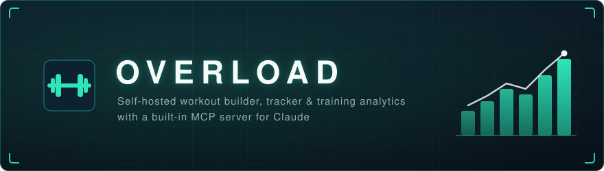
</p>

<p align="center">
  <b>Build workouts, track them at the gym, see your progress, track weight and food.<br>
  Claude can read and program your training through the built-in MCP server.</b>
</p>

**DISCLAIMER:** Overload was written by [Claude Code](https://claude.com/claude-code). It ships
an MCP server so Claude keeps working with the training data after the code is done.

## Screenshots

<sub>All screenshots use a generated demo dataset, not anyone's real training log. Sections
follow the app's menu.</sub>

<details>
<summary><b>Dashboard</b> — the week at a glance: volume, sets, recovery, what's next</summary>
<p align="center">
  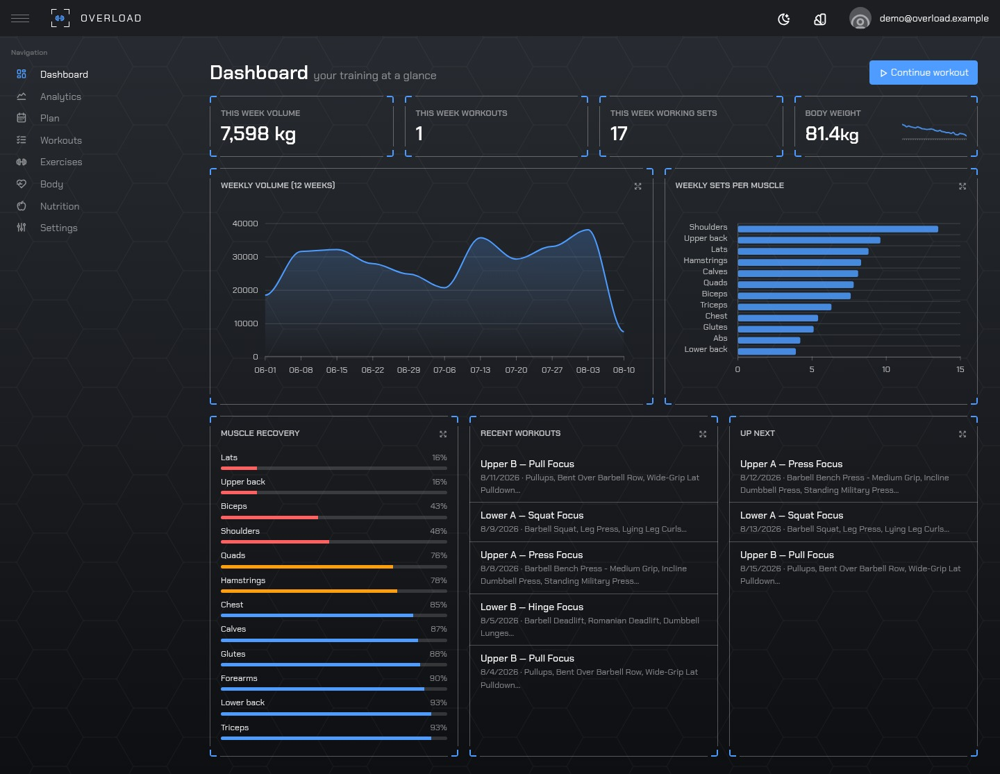
</p>
<p align="center">
  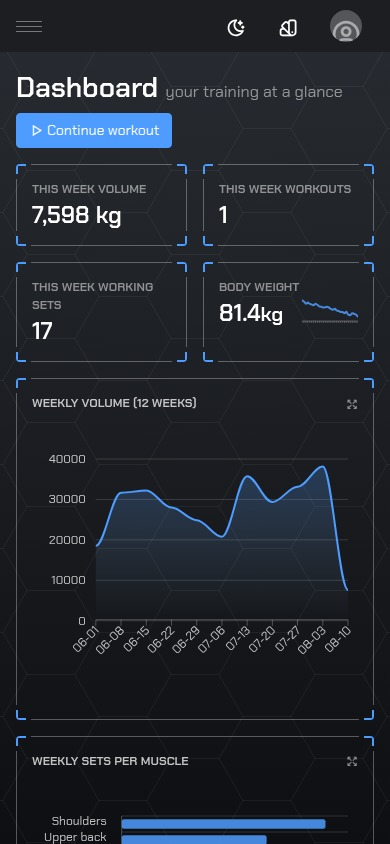
</p>
</details>

<details>
<summary><b>Analytics</b> — sessions vs plan target, weekly volume, strength trend per lift, sets per muscle</summary>
<p align="center">
  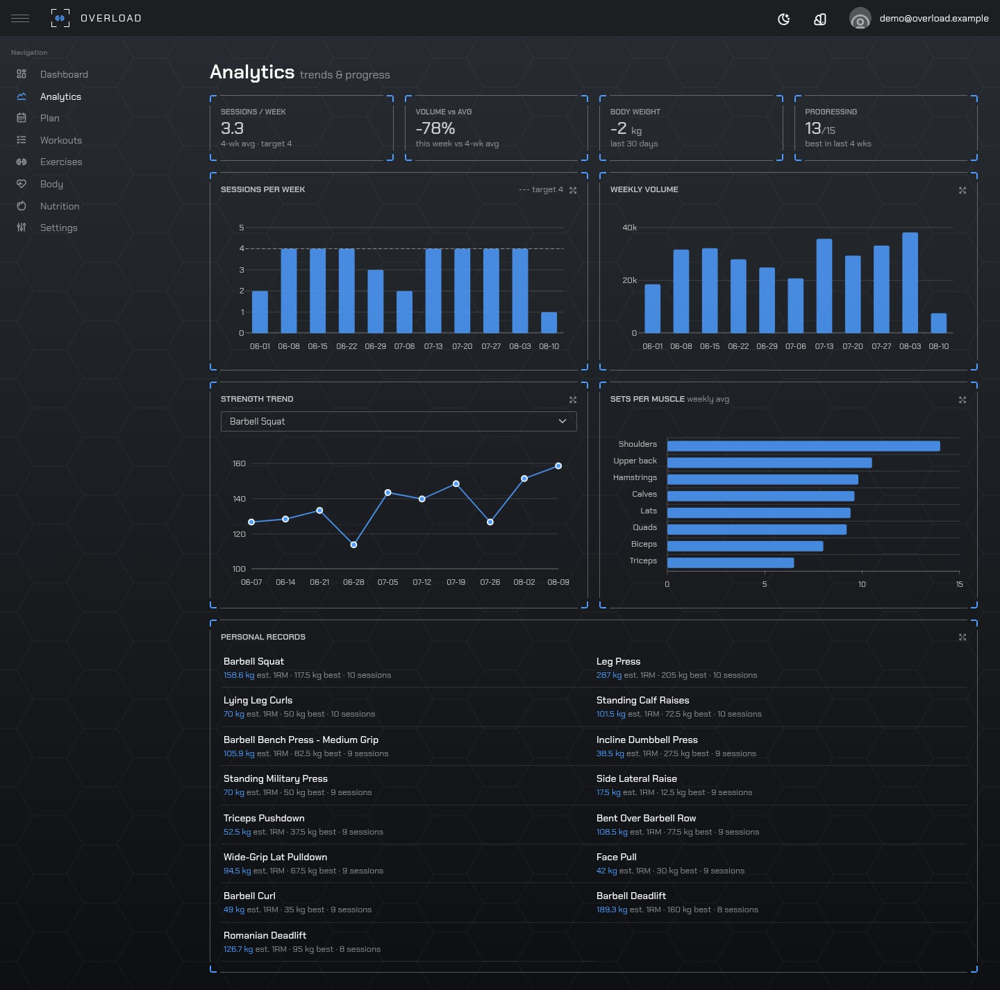
</p>
<p align="center">
  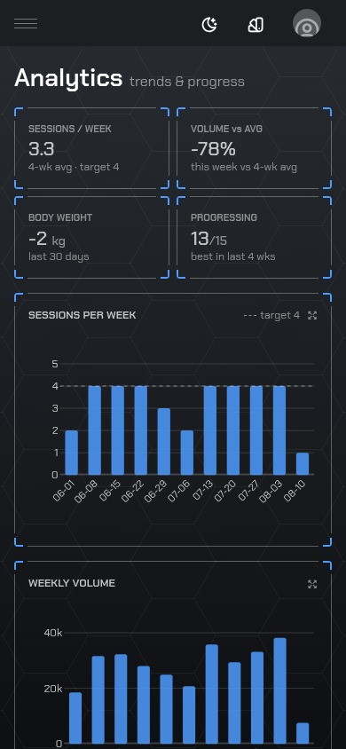
</p>
</details>

<details>
<summary><b>Plan</b> — training days, target muscles, deload weeks, notes the generator reads back</summary>
<p align="center">
  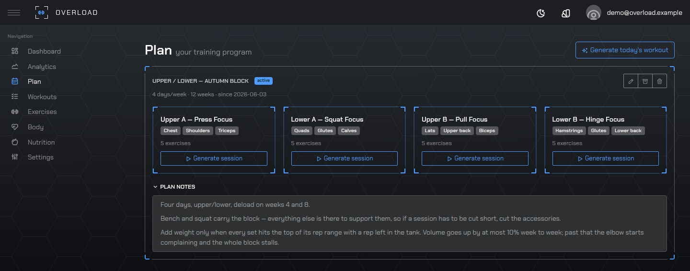
</p>
</details>

<details>
<summary><b>Workouts</b> — the live logger: session clock, rest timer, effort rating after each set</summary>

The session clock and rest timer keep running while the screen is off or you navigate away;
every set already logged stays on screen while you add the next one.

<p align="center">
  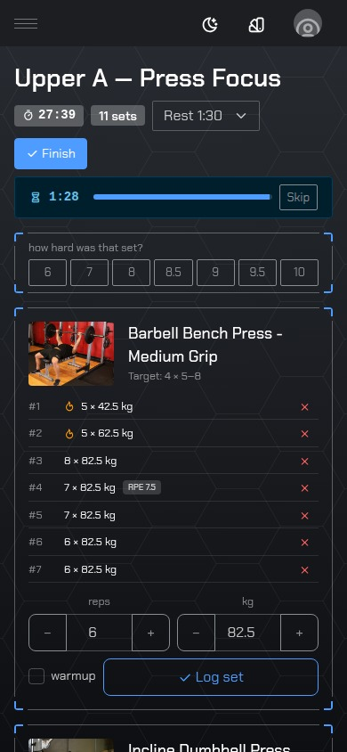
  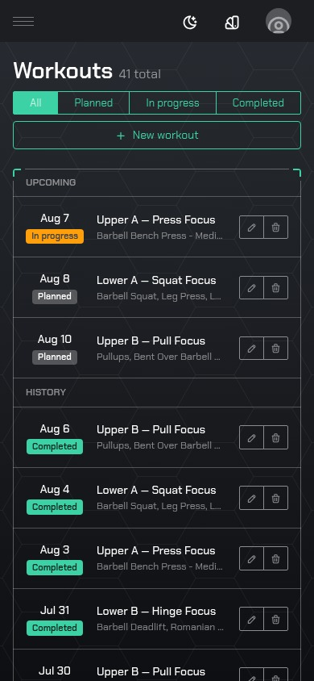
</p>

A finished session, with warm-up sets marked and excluded from volume.

<p align="center">
  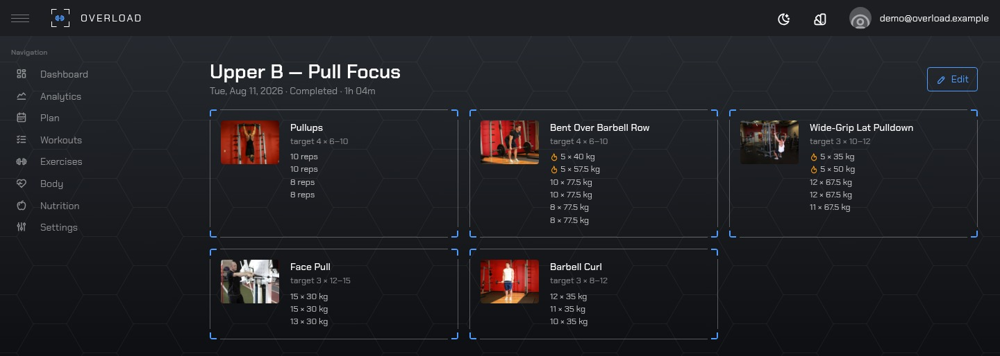
</p>
</details>

<details>
<summary><b>Exercises</b> — 881 in the catalog, with photos, instructions, muscles and equipment</summary>
<p align="center">
  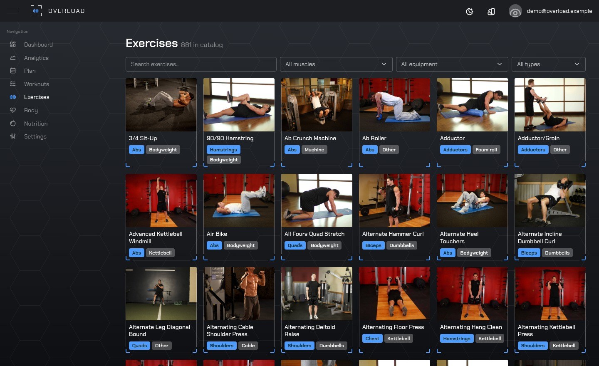
</p>
</details>

<details>
<summary><b>Body</b> — weigh-ins with a 7-day average, plus any measurement you want to track</summary>
<p align="center">
  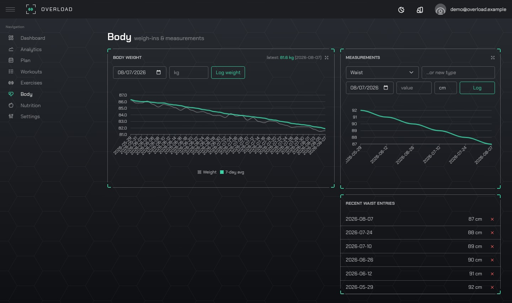
</p>
</details>

<details>
<summary><b>Nutrition</b> — calories and macros, logged once a day</summary>
<p align="center">
  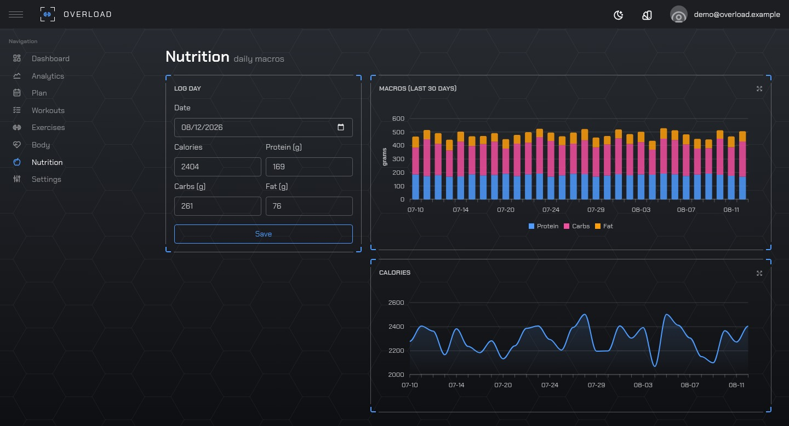
</p>
<p align="center">
  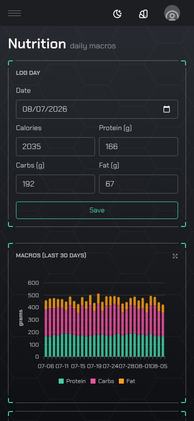
</p>
</details>

<details>
<summary><b>Settings</b> — units, equipment, API keys for Claude, user management</summary>
<p align="center">
  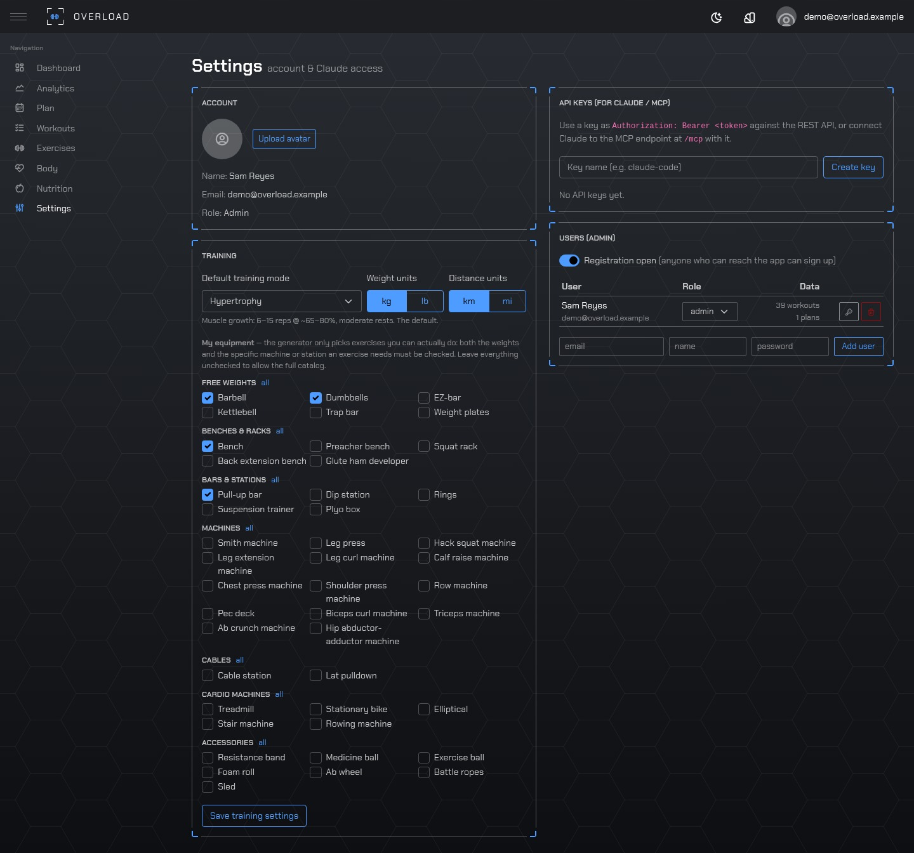
</p>
</details>

## Using the app

**First time**
1. Open the app in your browser and tap **Sign up**. The first account becomes the admin; after that, sign-ups are closed.
2. Go to **Settings**:
   - Pick **kg or lb**.
   - Pick your **training mode** (leave "Hypertrophy" if unsure).
   - Check the **equipment you have**. Leave everything unchecked if you train in a full gym.
3. Adding family? As admin, use **Settings → Users (Admin)** to add accounts, reset passwords, delete a user with all their data, or temporarily reopen sign-ups.

**Get a plan** — either write one yourself in **Plan**, or let Claude write it for you.

Connect Claude once (see [Claude / MCP](#claude--mcp)), then just talk to it: how long you have
been training, what you are aiming at, how many days a week you can make, what equipment you
have, which joints you have to work around. It reads whatever history is already in the app and
writes a real plan back into it — training days, exercises, sets and rep ranges, weekday
anchors, deload weeks. Tell it when something changes — a tweaked shoulder, a week away, a new
goal — and ask it to adjust; it edits the plan in place rather than starting over.

From there the app generates each session from the plan, and Claude can generate them too.

**Have it read your sessions back.** Once a few are logged, ask Claude how the block is going. It
sees what you actually lifted rather than a summary: every set, how volume moved week to week,
which lifts are climbing and which have stalled, which muscles you have been short-changing,
what is still fatigued. Then tell it the parts the numbers miss — the last set of squats was a
grind, the shoulder is grumbling, Thursdays never happen — and ask it to adjust. It rewrites the
plan around both, and the next generated session comes off the new one.

**Work out**
1. Open the **Dashboard** and press the big button — it says **Continue**, **Start**, or **Generate today's workout** depending on where you are. Or build one yourself: **Workouts → New workout**.
2. Open the workout and press **Start**.
3. After each set, press **Log set**. The rest timer starts by itself.
4. Not sure how to do an exercise? Tap it — nearly every exercise has photos and instructions.
5. Press **Finish** when done.

**Track yourself**
- **Body**: log your weight each morning; add measurements like waist or arms.
- **Nutrition**: log calories and protein/carbs/fat once a day.
- **Dashboard** and **Analytics** show your progress: how much you lift, how strong you're getting, which muscles are recovered.

## How it works

All decisions are deterministic rules in `apps/server/src/services` — no model, no cloud, same
inputs → same plan. Claude can override any of it over MCP; these are the defaults.

### Training modes

Default in Settings; override per plan day or per generate call.

| Mode | Reps (compound / isolation) | Load | Sets | Rest |
|---|---|---|---|---|
| strength | 3–6 / 6–10 | ~95% of rep-max + warm-up ramp | 5 / 3 | 3:00 |
| hypertrophy (default) | 6–10 / 10–15 | ~95% of rep-max | 3 / 3 | 1:30 |
| endurance | 15–20 / 15–25 | ~90% of rep-max | 3 / 2 | 1:00 |
| power | 3–5, explosive compounds only | 50% e1RM, moved fast | 4 | 3:00 |

### Estimating strength

- Every working set yields an [Epley](https://en.wikipedia.org/wiki/One-repetition_maximum#Epley_formula) estimate: `e1RM = weight × (1 + reps / 30)`, reps capped at 12.
- An effort rating adjusts the reps first: rated RPE 8 with 8 reps counts as a 10-rep effort
  (`reps + reps-in-reserve`). Unrated sets count as taken to failure — the classic assumption.
- The best estimate across the last 3 sessions anchors the prescription.

### Prescribing the next weight

Double progression, bounded by the estimate:

1. Top of the rep range reached on all top-weight sets → add one increment; otherwise repeat the weight.
2. The effort rating sizes the jump: ≤ 6 → two increments; 9 or harder → hold; unrated or 7–8.5 → one.
3. Never above the weight where the *bottom* of the range would be a max effort; never below a weight already handled.
4. Increments: barbell/machine/cable 5 lb or 2.5 kg (doubled for lower-body strength work), dumbbells 5 lb or 2 kg, bodyweight and bands 0.
5. Everything is rounded onto the lifter's own plate grid — an lb lifter gets whole 5 lb steps, not converted kg.
6. Strength mode adds a 40 / 60 / 80% warm-up ramp when the working weight is ≥ 40 kg.

### Stalls and deloads

- 3 sessions with no new weight or reps → −10%, rebuilt from clean reps.
- 2 sessions rated 9.5+ with nothing gained → −10% immediately; grinding is not worth a third week.
- 3 flat sessions all rated ≤ 7 → no deload; that is a weight never pushed, not a stall.
- Plan deload weeks run at 60% of prescribed sets, −10% load.

### Effort scale

Ratings are reps in reserve, not a feeling out of ten. Optional — an unrated set behaves exactly
as it always did.

| rating | reps left in the tank |
|---|---|
| 10 | 0 — could not have done one more |
| 9.5 | 0, but the bar wasn't quite the limit |
| 9 | 1 |
| 8.5 | 1–2 |
| 8 | 2 |
| 7 | 3 |
| 6 | 4 |

### Recovery

Per-muscle fatigue is a sum of exponentially decaying set-equivalents: a primary-muscle working
set adds 1, a secondary 0.5, and the contribution halves-off with a time constant of 48 h for
large muscles (quads, hamstrings, glutes, back, chest) and 36 h for the rest. A muscle is fresh
below 2.0 set-equivalents. Freestyle generation picks the freshest muscle group; the dashboard
recovery panel is the same numbers.

### Counting rules

- Volume = reps × weight × multiplier. The multiplier is implements × sides
  (a pair of dumbbells used one leg at a time = ×4) and is seeded per exercise, editable per set.
- Warm-up sets are excluded from volume, records and estimates everywhere.
- Weekly sets per muscle: primary counts 1, secondary 0.5.
- Weekly charts zero-fill gaps — a skipped week shows as zero, not as a missing bar.

## Run your own server

### From the published image

No clone needed — [`exbarboss/overload`](https://hub.docker.com/r/exbarboss/overload) is built
for amd64 and arm64 on every release:

```bash
docker run -d --name overload \
  -p 3001:3001 \
  -v ./appdata:/data \
  -e DATABASE_URL=file:/data/overload.db \
  -e SESSION_SECRET=$(openssl rand -hex 32) \
  --restart unless-stopped \
  exbarboss/overload:latest
```

Or as a compose service:

```yaml
services:
  overload:
    image: exbarboss/overload:latest
    ports:
      - "3001:3001"
    environment:
      DATABASE_URL: file:/data/overload.db
      SESSION_SECRET: change-me-to-a-long-random-string
    volumes:
      - ./appdata:/data
    restart: unless-stopped
```

Open http://localhost:3001 and sign up. Update: pull the new tag and recreate the container —
migrations apply on start, and the database in `./appdata` is never touched by an upgrade.

### Build from source (Docker)

```bash
git clone git@github.com:eng1n88r/overload.git && cd overload
echo "SESSION_SECRET=$(openssl rand -hex 32)" > .env
docker compose up -d --build
```

- Open http://localhost:3002. The compose file maps `3002:3001`; change the left number to move it.
- The first `--build` takes a few minutes; seeding the catalog on top of that is about ten seconds.
- All data lives in `./appdata`, mounted into the container — so `docker compose down`, rebuilds
  and version upgrades leave the database alone. Back up that folder.
- Update: `git pull && docker compose up -d --build`. Migrations apply on start.
- Force a catalog re-seed: set `FORCE_SEED=1` once.
- The compose file also starts **`overload-test`** on :3003 — a second instance with its own
  database for trying things out. Fill it with the demo user once:
  `docker exec overload-test node dist/seed-demo.js`, then sign in as
  `demo@overload.example` / `overload-demo`.

### Without Docker

Node.js 22+. The database is one SQLite file that nothing in the app ever deletes: point
`DATABASE_URL` at a path you own and stopping the server, rebuilding, or pulling a new version
all leave it exactly where it is.

```bash
git clone git@github.com:eng1n88r/overload.git && cd overload
npm ci
(cd apps/server && npx prisma generate)
npm run build

mkdir -p appdata
cat > .env <<EOF
SESSION_SECRET=$(openssl rand -hex 32)
DATABASE_URL=file:$PWD/appdata/overload.db
PORT=3001
EOF

npx prisma migrate deploy --schema apps/server/prisma/schema.prisma   # create or upgrade the schema
node apps/server/dist/seed.js                                         # exercise catalog
node apps/server/dist/index.js                                        # serve
```

Open http://localhost:3001 and register. Ctrl-C to stop; run the last line again and everything
is still there.

- **Use an absolute path** for `DATABASE_URL`, as above. A relative `file:./x.db` is resolved
  against `apps/server/prisma/`, not your shell's working directory, which is a good way to end
  up with two databases and wonder where your data went.
- Run all three commands from the repository root — they read the `.env` there.
- After a `git pull`: `npm ci && npm run build`, then repeat the same three. `migrate deploy`
  runs only the migrations that have not run yet, and never resets the database the way
  `migrate dev` can; the seed skips a catalog it has already filled.
- To keep it running across reboots, wrap the last line in a systemd unit, a launchd job or pm2.
  Nothing about the app assumes a supervisor — it is one long-lived Node process.
- Back up `appdata/overload.db`. Copying the file while the server is stopped is enough.

## Claude / MCP

1. In the app: **Settings → API Keys → Create key** (`ovl_...`). Keys are scoped to the user who made them.
2. Connect Claude Code:

```bash
claude mcp add --transport http overload http://YOUR-SERVER:3001/mcp --header "Authorization: Bearer ovl_YOUR_KEY"
```

Other MCP clients: streamable-HTTP endpoint `http://YOUR-SERVER:3001/mcp`, same header.
The same key works on the REST API (`Authorization: Bearer ovl_...` on `/api/v1/*`).

Claude gets 28 user-scoped tools.

<details>
<summary><b>14 reading tools</b></summary>

<br>

- `get_dashboard` — session-opener rollup in one call: active plan, what's upcoming or in
  progress, recent sessions, recovery hotspots, latest body weight, this week's volume
- `query_workout_history` — workouts with their sets, filtered by date, status or exercise
- `get_exercise_stats` — one exercise: e1RM trend, volume, and the last three sessions in full
- `get_prs` — max weight and best e1RM for the most-trained exercises
- `get_weekly_volume` — working volume (kg), sets and workout count per week
- `get_muscle_volume` — weighted working sets per muscle per week (primary 1, secondary 0.5)
- `get_recovery_state` — per-muscle recovery from the last 7 days, 100% being fully fresh
- `get_body_metrics` — weight, waist, body fat and any custom measurement, as a time series
- `get_nutrition_summary` — daily calories and macros over a date range
- `get_active_plan` — the active plan with its days and exercise templates
- `get_plan` — any plan by id, archived ones included
- `list_plans` — every plan: id, name, status, dates
- `list_exercises` — fuzzy catalog search (token and synonym based, punctuation-insensitive);
  several queries in one call
- `resolve_exercise_names` — import dry run: which names map to which catalog entries, and what
  the near misses were

</details>

<details>
<summary><b>14 writing tools</b></summary>

<br>

- `create_workout` — one workout, planned for later or completed with its sets
- `bulk_create_workouts` — many at once, for importing history
- `update_workout` — PATCH by id
- `delete_workout` — permanent
- `log_set` — append a set mid-session ("log 61 kg × 10 on squat"), adding the exercise if the
  workout doesn't have it yet
- `log_body_metric` — log or overwrite a measurement for a day
- `log_nutrition` — log or overwrite a day's calories and macros
- `create_plan` — a plan (mesocycle), made active
- `adjust_plan` — PATCH by id; days keep their identity per `dayIndex`
- `generate_workout` — run the deterministic generator from a plan day, explicit muscles, or the
  freshest muscle group
- `generate_week` — a week of sessions from the plan, on its weekday anchors
- `create_exercise` — add something the catalog is missing
- `update_exercise` — correct catalog metadata: load factor, whether a movement is timed
- `add_exercise_alias` — map another app's name onto a catalog exercise

</details>

- Update tools are true PATCH: omitted fields stay unchanged.
- Exercise references accept id, exact name, or alias.
- Full catalog available as the `catalog://exercises` MCP resource.
- Plan templates support per-exercise load, RIR, rest, per-side and seconds targets, weekday anchors, deload weeks.

To preload an account from another app's export: put the export in `data/` (git-ignored),
connect Claude, and ask it to map names (`resolve_exercise_names`, `add_exercise_alias`),
import history (`bulk_create_workouts` with stable `externalId`s), and build a plan (`create_plan`).

## Development

Requires Node.js 22+.

```bash
npm install
cp .env.example .env          # set SESSION_SECRET
cp .env apps/server/.env
npm run db:migrate            # creates SQLite db + seeds exercise catalog
npm run dev                   # API on :3001, web on :5173
```

Windows PowerShell: use `Copy-Item` instead of `cp`.

Open http://localhost:5173 and register.

- Tests: `npm test` (unit + integration suite against a scratch SQLite db)
- Refresh exercise catalog: `scripts/fetch-exercise-db.sh` (`.ps1` on Windows), then `npm run db:seed`
- Release: `npm version <x.y.z> -ws --include-workspace-root --no-git-tag-version`, add a
  changelog entry, commit, tag `v<x.y.z>`, push — the tag builds and publishes the Docker image
- Layout: `apps/server` (Fastify + Prisma + SQLite), `apps/web` (Vue 3 + Vite, HUD theme), `packages/shared` (zod schemas)

## Notes

- `data/` (personal exports) and `appdata/` (live database) are git-ignored.
- Weights stored in kg; warm-up sets excluded from analytics.
- **Styling origin** — the UI began from a purchased HUD ThemeForest template. Its code, assets,
  attribution and naming have been removed; the stylesheets are Bootstrap 5 plus this app's own
  partials, and the background and icons are generated here. What remains inherited is the look:
  the accent palette and the spacing and radius values behind it.

## Licence

Overload is released under the [MIT licence](LICENSE).

### Third-party

| | | |
|---|---|---|
| [free-exercise-db](https://github.com/yuhonas/free-exercise-db) | exercise catalog and images in `apps/server/prisma/seed-data/` | [Unlicense](https://github.com/yuhonas/free-exercise-db/blob/main/LICENSE) (public domain) |
| [Tabler Icons](https://github.com/tabler/tabler-icons) | the 32-glyph subset in `apps/web/src/assets/icons/` | MIT |
| [Chakra Petch](https://fonts.google.com/specimen/Chakra+Petch) | UI typeface, self-hosted via `@fontsource` | SIL Open Font License 1.1 |
| [Bootstrap](https://getbootstrap.com) | CSS framework | MIT |

The exercise dataset originates with [Ollie Jennings](https://github.com/jhonnyx2012), whom
free-exercise-db credits as its source. It is public domain and carries no attribution
requirement; it is credited here because it is the larger part of this repository by size and
none of it is our work.

## Changelog

### 0.2.0

- Effort ratings (RPE): asked on the rest bar after each set, tap any logged set to rate or fix
  it later, half steps above 8. Ratings feed the strength estimate, the size of the next jump,
  and stall/deload detection.
- Prescribed weights land on the lifter's plate grid — whole 5 lb steps for lb users instead of
  converted kg values like 35.3 lb.
- Charts: dragging reads out values instead of zooming, tooltips snap to the nearest point,
  stacked macro tooltip shows all three series, no more text selection on touch.
- Live cardio: the minutes field follows the session clock, and cardio sets no longer start a
  rest countdown.
- iOS fixes: pinch-zoom no longer crashes the tab (backdrop collapsed to one layer).
- Run-without-Docker guide, published Docker image, demo dataset, version in the footer.

### 0.1.0

- Initial release: workout builder and generator, live logger, analytics, body and nutrition
  tracking, exercise catalog, admin user management, MCP server for Claude.
